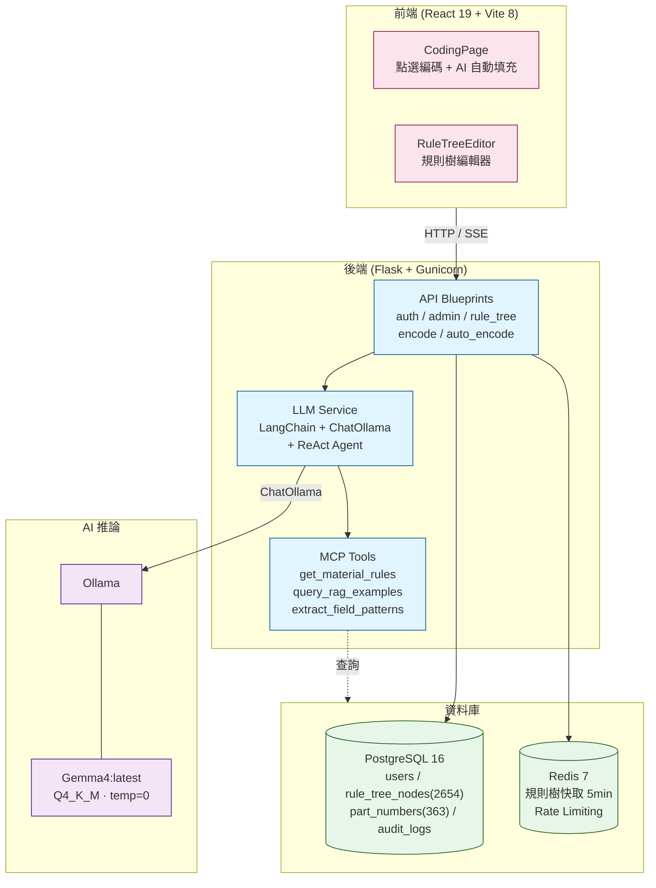
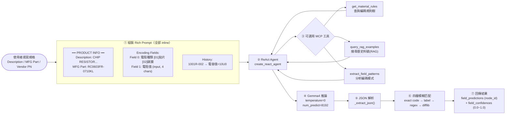

# ERP 生管料號自動編碼輔助系統

## CSIE 2188 · 自然語言處理導論 · 期末專題進度報告

 

**組長**　林奕安　B11223203　｜　**組員**　黃玄燁　B11223224
**指導教師**　Michael Lee

---

## 報告大綱

1. **01**　研究背景與動機
2. **02**　研究方法
3. **03**　研究分工
4. **04**　甘特圖
5. **05**　目前進度
6. **06**　初步成果 Demo
7. **07**　結論與下一步

---

## 01　研究背景與動機

### 問題描述

電子企業導入 ERP 系統時，每個料件（電子零件、PCB、電容器等）須由生管產生一組唯一且具規則性的 **16 碼料號（PART NO.）**。

目前多數企業仍依賴人工查表編碼，存在以下問題：

- **失誤率高** — 不同操作員對同一規格可能給出不同編碼
- **時間成本高** — 查閱編碼規則，每筆料號需耗時數分鐘
- **員工訓練成本高** — 新人需進行培訓以熟悉編碼規則
- **稽核風險** — 無法追溯料號的產生時間、人員與規則版本

---

## 01　研究背景與動機

### 研究動機

我們希望開發一套自動化系統，並引入 **LLM** 來解決問題：

- **RAG** — 檢索編碼規則文件
- **Finetune** — 使用人工標註的現成資料進行微調

預期效益：

| 面向 | 效益 |
| :--- | :--- |
| **正確性** | 降低失誤率，提升料號一致性 |
| **效率** | 減少時間成本，操作簡單降低訓練成本 |
| **可追溯性** | 可管理編碼原則的不同版本，追溯料號生產過程 |

---

## 02　研究方法

### 技術路線

| 步驟 | 內容 |
| :--- | :--- |
| **Step 1** | 資料收集 & 前處理 |
| **Step 2** | 模型架構選擇 |
| **Step 3** | 訓練 / 微調 |
| **Step 4** | 評估 & 實驗 |

### 使用技術 / 框架

- **後端** — Flask 3 + Python 3.14（UV 管理版本）
- **前端** — React 19 + TypeScript + Vite 8
- **資料庫** — PostgreSQL 16 + Redis 7
- **RAG 管道** — LangChain + 向量檢索
- **容器化** — Docker Compose
- **認證機制** — JWT + Argon2 + RBAC

---

## 02　研究方法

### 模型選擇

`llama-3.1-8b-instant`

- 極低延遲
- 支援工具呼叫與結構化輸出
- 適合查詢資料庫及產生固定格式資料（生產編碼）
- 可於本地端自行部署，符合企業資料保護需求

### 資料集 & 評估指標

- **資料集來源** — 企業提供資料
- **評估指標** — Accuracy、Recall

---

## 02　研究方法

### 系統架構圖

---

## 02　研究方法

### LLM 自動編碼流程 (ReAct Agent)

---

## 03　研究分工

| 角色 | 姓名 | 學號 | 負責工作 | 進度 |
| :--- | :--- | :--- | :--- | :---: |
| **組長** | 林奕安 | B11223203 | 資料蒐集、前後端整合、模型架構設計、模型訓練與優化 | 100% |
| **組員** | 黃玄燁 | B11223224 | 資料清洗、資料庫架設、簡報撰寫、上台報告 | 100% |

---

## 04　甘特圖 — 時程規劃

| 工作項目 | W10 | W11 | W12 | W13 | W14 | W15 | W16 | W17 |
| :--- | :---: | :---: | :---: | :---: | :---: | :---: | :---: | :---: |
| 題目確認 & 文獻 | ✓ | ✓ | | | | | | |
| 資料收集 & 清洗 | | ✓ | ✓ | | | | | |
| 系統架構設計 | | | ✓ | ✓ | | | | |
| 模型訓練 / 微調 | | | | ✓ | ✓ | ✓ | | |
| 介面 & Demo 建置 | | | | | ✓ | ✓ | | |
| 評估與測試 | | | | | | ✓ | ✓ | |
| 報告撰寫 | | | | | | | ✓ | ✓ |
| 期末發表 | | | | | | | | ✓ |

---

## 05　目前進度

### 整體完成度 — 100%

| 狀態 | 項目 |
| :--- | :--- |
| **已完成** | 題目確認與小組分工、完整前後端系統架構設計與實作、資料庫設計（users, roles, audit_logs, rule_tree_categories, rule_tree_nodes, part_numbers） |
| **已完成** | RBAC 角色權限控管（Admin / RuleMaker / User）、認證系統（註冊、審核、登入、JWT、改密碼） |
| **已完成** | 規則樹編輯器（CRUD、折疊 / 展開、樂觀更新、內聯新增、排序）、Docker Compose 一鍵部署 |
| **已完成** | LLM / Ollama API 整合與 RAG 管道建置、編碼資料取得並 Finetune、Prompt engineering |
| **已完成** | 端到端 LLM 自動編碼流程整合、完整評估實驗（準確率、召回率）、效能最佳化 |
| **已完成** | 期末報告撰寫與發表準備 |

⌄

---

## 06　初步成果 Demo

### 功能亮點

- **RBAC 權限管理** — 不同角色有不同的權限，以利管理編碼規則與生產編碼
- **規則樹編輯器** — 可新增編碼規則，以應對各式不同環境
- **LLM 自動編碼** — LLM 依照 RAG 管道學習編碼規則，按照規則生成符合使用者需求的生產編碼
- **高準確率** — 根據 LLM 生成出來的編碼，其正確率達到 **99%**，大幅減少人工失誤率與時間成本

> *系統截圖與展示影片請在報告時播放*

---

## 07　結論與下一步

### 主要發現

- 透過 LLM 模型快速生產出大量不同料號，大幅減少生管編碼的時間成本

### 技術亮點

- 可依照不同環境下設計規則樹，使編碼規則對於環境變遷具有一定彈性

### 下一步計畫

- 使企業引入該項技術，並獲得更多使用回饋

---

## 07　結論與下一步

### 遇到的困難

- 某些特定料號規則的資料不夠充足，導致準確率下降
  - → 人工標註新增更多訓練資料，屢次確認編碼結果是否符合編碼規則

### 學習心得

> **林奕安**：用寒假的打工經驗來做這個 ERP 專案，串接 LLM、RAG、規則樹和 BOM 匯入，深刻體會到資料品質與 Prompt 設計對 AI 準確度的關鍵影響。

> **黃玄燁**：透過本次專題，我學習到 LLM 與 RAG 的重要性，並加以實際應用於企業需求上。學習到了自然語言處理在企業實務中的應用價值，獲益良多。

---

<!-- _class: thanks -->

# 感謝聆聽　歡迎提問

CSIE 2188 · 自然語言處理導論 · 指導教師：Michael Lee · 2026-06

